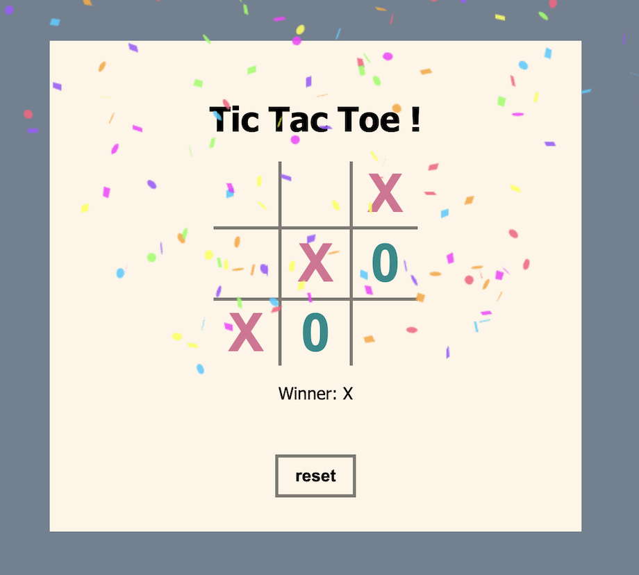

# 🪁 Tic-Tac-Toe — TypeScript Edition

## ✨ About the Project
Welcome to my classic Tic-Tac-Toe game! I built this project to solidify my transition from JavaScript to **TypeScript**. My main goal was to understand how strict typing, custom types, and interfaces can make DOM manipulation safer and more predictable.

Instead of relying on heavy frontend frameworks, this app is built with Vanilla TypeScript and bundled with **Vite** for lightning-fast development. It features a custom-built state management system using TypeScript Tuples to represent the board, and CSS Grid for a clean, responsive layout.

This project proves that with good typing, you can catch bugs before the code even reaches the browser! 🛡️

## ✨ Features

### 🧩 Core Mechanics
- Playable 3x3 Tic-Tac-Toe grid.
- Strict turn-based logic (X and O).
- Real-time DOM updates reflecting the underlying game state.

### 🛡️ TypeScript Highlights
- **Custom Types & Tuples:** The board state is strictly typed as a 3x3 matrix, preventing invalid data structures.
- **Type Casting:** Safe and predictable retrieval of HTML Elements.
- **Union Types:** Ensuring only valid moves (`"X"`, `"O"`, or `""`) can be passed into the game logic.

### 🎨 UI & UX
- Elegant, minimalist design using **CSS Grid**.
- Clever CSS attribute selectors (`data-row`, `data-col`) used for generating the board's borders without duplicating lines.
- Fun **Canvas Confetti** animation to celebrate a victory! 🎉

## 🍬 First Look

## 🍬 Technologies

- **TypeScript** (Strict Mode)
- **HTML5 & CSS3** (CSS Grid, Custom Properties/Variables)
- **Vite** (Build tool & Dev Server)
- **canvas-confetti** (NPM package for victory animations)
## 🍬 Inspiration & Credits

This project was built as part of an awesome TypeScript course by **[Fireship.io](https://fireship.io/)** 🔥. 

---
*Created with passion for clean code and continuous learning.* 🚀

